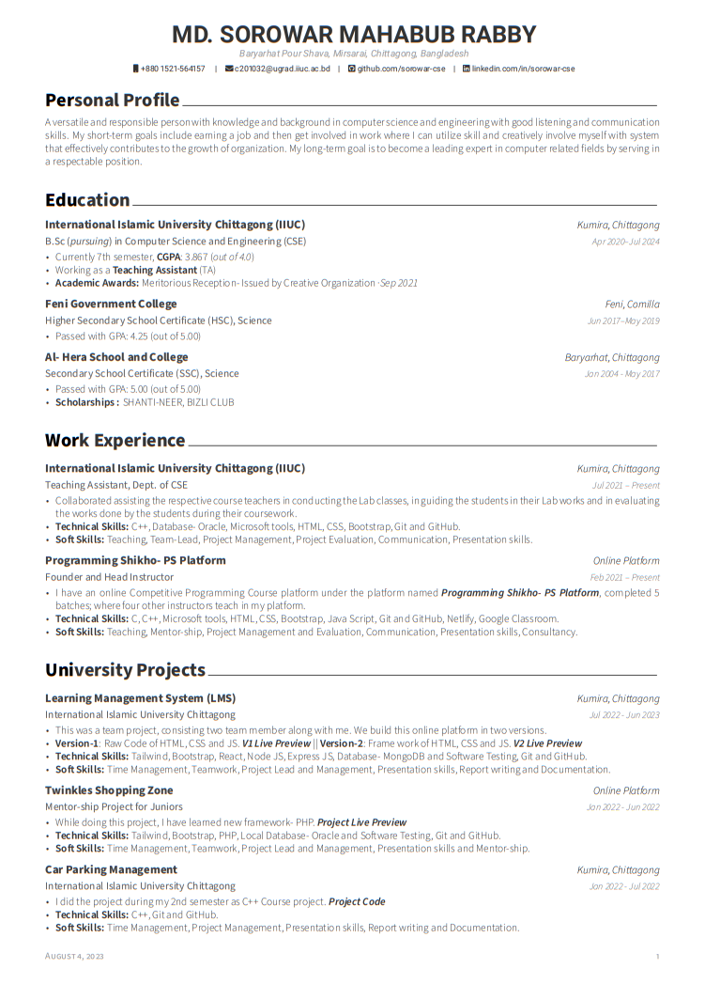

# Creating a Custom LaTeX CV Class and Designing Your Own CV in Overleaf

Welcome to the guide on creating your own custom LaTeX class for designing a professional curriculum vitae (CV) using Overleaf. A well-designed CV can make a strong impression, and with LaTeX, you have complete control over its formatting and layout.
## Table of Contents

- [Prerequisites](#prerequisites)
- [Getting Started](#getting-started)
  - [Clone or Download](#clone-or-download)
  - [Modify `cv-template.tex`](#modify-cv-templatetex)
- [Creating the LaTeX CV Class File](#creating-the-latex-cv-class-file)
  - [Customize `mycv.cls`](#customize-mycvcls)
- [Designing Your CV in Overleaf](#designing-your-cv-in-overleaf)
  - [Upload Files](#upload-files)
  - [Edit `cv-template.tex` in Overleaf](#edit-cv-templatetex-in-overleaf)
- [Previewing and Generating the CV](#previewing-and-generating-the-cv)
  - [Compile in Overleaf](#compile-in-overleaf)
  - [Make Adjustments](#make-adjustments)
- [Exporting Your CV](#exporting-your-cv)
- [Additional Resources](#additional-resources)
- [Author](#author)
- [License](#license)

  
## Prerequisites

- Basic knowledge of LaTeX syntax.
- An account on [Overleaf](https://www.overleaf.com/).

  

## Getting Started

1. Clone or download this repository to your local machine.

2. Open the `cv-template.tex` file in your preferred LaTeX editor (e.g., Overleaf, TeXShop, etc.).

3. Modify the content in the `cv-template.tex` file to customize your CV. Pay attention to the comments provided to guide you through the customization process.

## Creating the LaTeX CV Class File

1. Open the `mycv.cls` file. This is the LaTeX class file that defines the formatting and structure of your CV.

2. Customize the class file to match your desired CV layout. Refer to the comments within the `mycv.cls` file for guidance on making modifications.

## Designing Your CV in Overleaf

1. Visit [Overleaf](https://www.overleaf.com/) and log in to your account (or create one if you don't have it yet).

2. Create a new project in Overleaf.

3. Upload the `mycv.cls` file and the `cv-template.tex` file to your Overleaf project.

4. Edit the `cv-template.tex` file directly in Overleaf to add your own content. You can use LaTeX commands to format text, add sections, and include details about your education, work experience, skills, etc.

## Previewing and Generating the CV

1. Use the "Compile" button in Overleaf to generate a PDF preview of your CV. This will help you see how the final document will look.

2. Make adjustments to the content and formatting as needed based on the PDF preview.

## Exporting Your CV

1. Once you're satisfied with the design and content of your CV, you can download the PDF by clicking the "Download" button in Overleaf.

## Additional Resources

- [LaTeX Project Website](https://www.latex-project.org/)
- [Overleaf Documentation](https://www.overleaf.com/learn)

## Author

This guide and repository are created and maintained by [Sorowar Mahabub](https://github.com/sorowar-cse).

## License

This project is licensed under the [MIT License](LICENSE).
